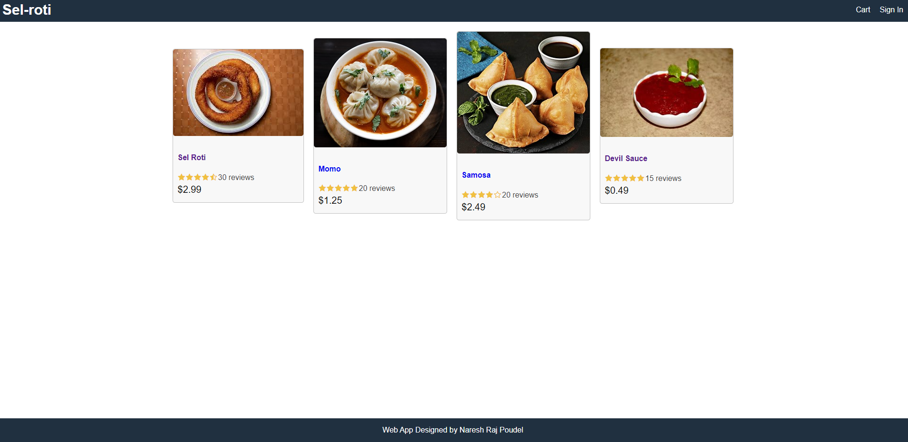

# Sel-roti the most popular food in Nepal

## Description

TThis is a web application which is used for ordering very popular Nepalese food called Sel-Roti (and other food items). 
When this app is open(run), it presents a page with a some products (food items) on the centre main view and signin and cart buttons on the top right corner.
The user can order the food item by clicking on it and adding to the cart

## Demo

HOMESCREEN

REGISTER

SIGNIN

CART

## [Live App](https://heroku/)   (https://heroku)

## Table of Contents

-   [Installation](#installation)
-   [Usage](#usage)
-   [License](#license)
-   [Live_App](#Live_App)
-   [Authors](#Authors)
-   [Acknowledgments](#Acknowledgments)
-   [Questions](#questions)

## Installation

For installation clon the repo and install dependencies on the root folder. Change directory to "frontend" and install dependencies (for react) go back to root folder and run the command "npm start" do same inside the frontend folder as well. The page will start in localhost with port 3000

## License

    								MIT License

    		Team Profile Generator   Copyright (C) 2021 Naresh Raj Poudel

    		Permission is hereby granted, free of charge, to any person obtaining a copy
    		of this software and associated documentation files (the "Software"), to deal
    		in the Software without restriction, including without limitation the rights
    		to use, copy, modify, merge, publish, distribute, sublicense, and/or sell
    		copies of the Software, and to permit persons to whom the Software is
    		furnished to do so, subject to the following conditions:

    		The above copyright notice and this permission notice shall be included in all
    		copies or substantial portions of the Software.

    		THE SOFTWARE IS PROVIDED "AS IS", WITHOUT WARRANTY OF ANY KIND, EXPRESS OR
    		IMPLIED, INCLUDING BUT NOT LIMITED TO THE WARRANTIES OF MERCHANTABILITY,
    		FITNESS FOR A PARTICULAR PURPOSE AND NONINFRINGEMENT. IN NO EVENT SHALL THE
    		AUTHORS OR COPYRIGHT HOLDERS BE LIABLE FOR ANY CLAIM, DAMAGES OR OTHER
    		LIABILITY, WHETHER IN AN ACTION OF CONTRACT, TORT OR OTHERWISE, ARISING FROM,
    		OUT OF OR IN CONNECTION WITH THE SOFTWARE OR THE USE OR OTHER DEALINGS IN THE
    		SOFTWARE.

## Live_App

* You can view the live app on heroku at (https://heroku).

## Authors

* **Naresh Raj Poudel** - [Git Hub Profile](https://github.com/citenaresh): https://github.com/citenaresh

## Acknowledgments

* Great gratitude to Luca ([https://github.com/duvet86](https://github.com/duvet86)), Sam ([https://github.com/sam-ngu](https://github.com/sam-ngu)) and Renata from the UWA Bootcamp for their enormous help.

## Questions

-   For any questions related to this applicaiton, please feel free to contact me at: citenareshn@gmail.com.

-   Please use this link to access my Github Profile: [Git Hub Profile](https://github.com/citenaresh): https://github.com/citenaresh
